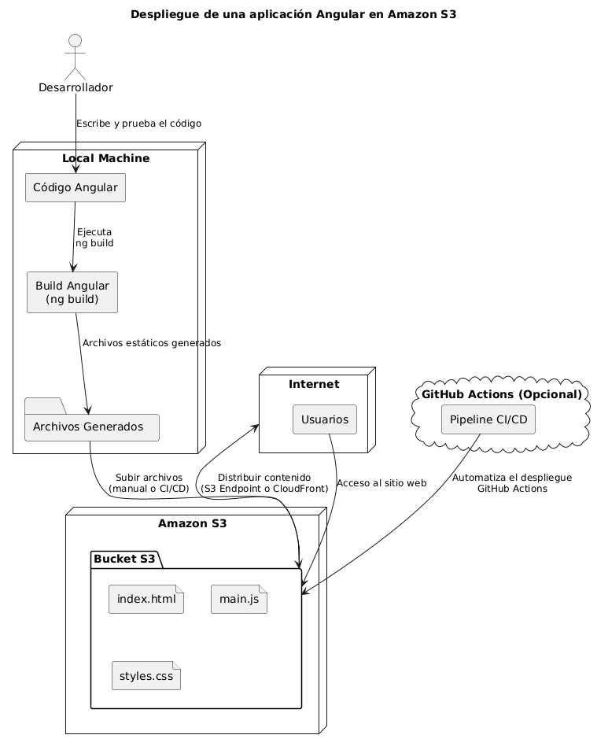

# Codelab AWS Angular S3

## Repositorio del proyecto

El código fuente de este codelab está disponible en el siguiente repositorio de GitHub:

[Repositorio del codelab en GitHub](https://github.com/JuanLopezAranzazu/aws-angular-s3)

## Despliegue de una aplicación Angular en un bucket S3

En este codelab, aprenderás a desplegar una aplicación Angular en un bucket de Amazon S3. A continuación, se muestra la arquitectura de despliegue que utilizaremos:



## Crear un bucket S3

1. Inicia sesión en la consola de administración de AWS.
2. Navega a la sección de S3 y crea un nuevo bucket.
3. Configura el bucket para alojar un sitio web estático:
   - Ve a la pestaña "Properties" del bucket.
   - Habilita la opción "Static website hosting".
   - Especifica `index.html` como documento de índice y `error.html` como documento de error.
4. Configura las políticas de acceso para permitir el acceso público a los archivos del bucket.

## Configurar credenciales de AWS

Para que el pipeline de despliegue pueda acceder a tu bucket S3, necesitarás configurar las credenciales de AWS en los secretos de tu repositorio de GitHub:

1. Ve a la configuración de tu repositorio en GitHub.
2. Navega a la sección "Secrets and variables" > "Actions".
3. Añade los siguientes secretos:
   - `AWS_ACCESS_KEY_ID`: Tu clave de acceso de AWS.
   - `AWS_SECRET_ACCESS_KEY`: Tu clave secreta de AWS.
   - `AWS_REGION`: La región donde se encuentra tu bucket S3 (por ejemplo, `us-east-1`).
   - `AWS_BUCKET_NAME`: El nombre de tu bucket S3.

## Pipeline de despliegue

```yml
name: Deploy Angular to AWS S3

on:
  push:
    branches:
      - main

jobs:
  build-and-deploy:
    runs-on: ubuntu-latest

    steps:
      # Clonar el repositorio
      - name: Checkout repo
        uses: actions/checkout@v3

      # Configurar Node.js
      - name: Setup Node.js
        uses: actions/setup-node@v3
        with:
          node-version: '20'

      # Instalar pnpm
      - name: Install pnpm
        run: npm install -g pnpm

      # Instalar dependencias con pnpm
      - name: Install dependencies
        run: pnpm install

      # Construir Angular para producción
      - name: Build Angular
        run: pnpm ng build --configuration production

      # Configurar credenciales AWS
      - name: Configure AWS credentials
        uses: aws-actions/configure-aws-credentials@v2
        with:
          aws-access-key-id: ${{ secrets.AWS_ACCESS_KEY_ID }}
          aws-secret-access-key: ${{ secrets.AWS_SECRET_ACCESS_KEY }}
          aws-region: ${{ secrets.AWS_REGION }}

      # Subir archivos compilados a S3
      - name: Deploy to S3
        run: |
          aws s3 sync dist/aws-angular-s3/browser/ s3://${{ secrets.AWS_BUCKET_NAME }} --delete
```

## Explicación del pipeline

1. **Clonar el repositorio**: Utilizamos la acción `actions/checkout` para clonar el repositorio donde se encuentra el código fuente de la aplicación Angular.
2. **Configurar Node.js**: Configuramos el entorno de Node.js utilizando la acción `actions/setup-node`, especificando la versión 20.
3. **Instalar pnpm**: Instalamos el gestor de paquetes `pnpm` globalmente.
4. **Instalar dependencias**: Instalamos las dependencias del proyecto utilizando `pnpm install`.
5. **Construir Angular para producción**: Ejecutamos el comando `pnpm ng build --configuration production` para compilar la aplicación Angular en modo producción.
6. **Configurar credenciales AWS**: Utilizamos la acción `aws-actions/configure-aws-credentials` para configurar las credenciales de AWS necesarias para interactuar con los servicios de AWS.
7. **Subir archivos compilados a S3**: Finalmente, utilizamos el comando `aws s3 sync` para sincronizar los archivos compilados de la aplicación Angular con el bucket S3 especificado, eliminando cualquier archivo que ya no esté presente en la compilación.

## Ruta de acceso a la aplicación

Una vez que el pipeline se haya ejecutado correctamente, la aplicación Angular estará disponible en el bucket S3. Puedes acceder a ella utilizando la siguiente URL:

```
http://<NOMBRE_DEL_BUCKET>.s3-website-<REGION>.amazonaws.com
```
