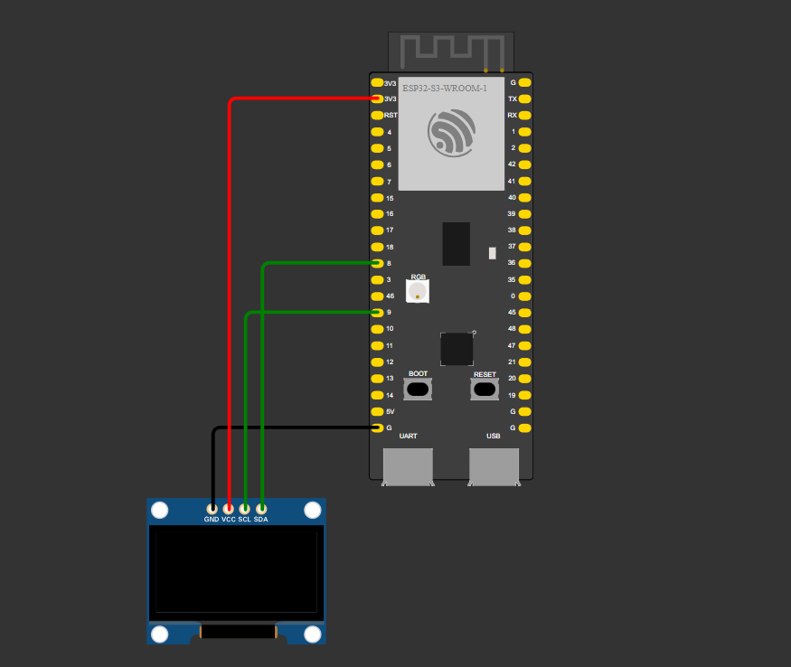

# Proyecto ESP32-S3 con Pantalla OLED SSD1306

## Descripción del proyecto

Este proyecto utiliza un **ESP32-S3** para controlar una **pantalla OLED SSD1306** mediante I2C. Muestra múltiples pantallas con información dinámica y animaciones, rotando automáticamente cada 3 segundos.

## Requisitos

- **Microcontrolador:** ESP32-S3
- **Pantalla OLED:** SSD1306 (128x64 píxeles)
- **Conexiones I2C:**
  - SDA → Pin 8
  - SCL → Pin 9
  - VCC → 3.3V
  - GND → GND
- Biblioteca Adafruit GFX
- Biblioteca Adafruit SSD1306

## Diagrama de conexiones

## Compilar y subir el programa

1. Conecta tu ESP32-S3 al puerto USB.
2. Haz clic en Build (compilar) en PlatformIO.
3. Haz clic en Upload (subir) para cargar el programa en la placa.
4. Presiona RESET si el monitor serie se queda esperando.
5. Abre el Monitor Serie para ver la salida del programa.

