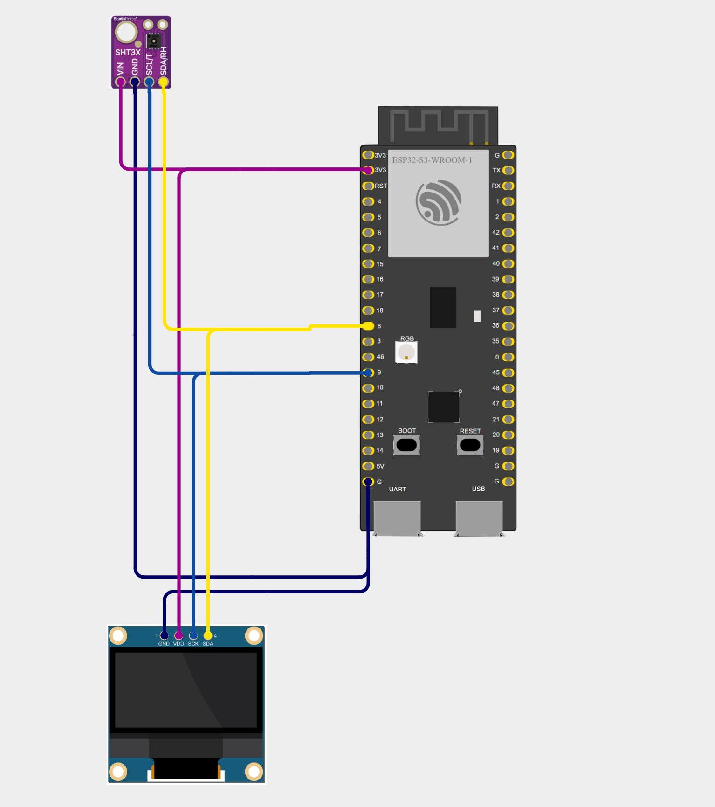

# Proyecto ESP32-S3 con pantalla OLED SDD1306 y Sensor SHT31

## Descripción del proyecto

Este proyecto utiliza un microcontrolador ESP32-S3 para leer datos de temperatura y humedad de un sensor SHT31 y mostrar esta información en una pantalla OLED SDD1306.

## Requisitos

- **Microcontrolador:** ESP32-S3
- **Pantalla OLED:** SSD1306 (128x64 píxeles)
- **Sensor de temperatura y humedad:** SHT31
- **Conexiones I2C:**
  - SDA → Pin 8
  - SCL → Pin 9
  - VCC → 3.3V
  - GND → GND
- Biblioteca Adafruit GFX
- Biblioteca Adafruit SSD1306
- Biblioteca Adafruit SHT31

## Diagrama de conexiones

## Compilar y subir el programa

1. Conecta tu ESP32-S3 al puerto USB.
2. Haz clic en Build (compilar) en PlatformIO.
3. Haz clic en Upload (subir) para cargar el programa en la placa.
4. Presiona RESET si el monitor serie se queda esperando.
5. Abre el Monitor Serie para ver la salida del programa.
6. Deberías ver los datos de temperatura y humedad actualizándose en la pantalla OLED.
