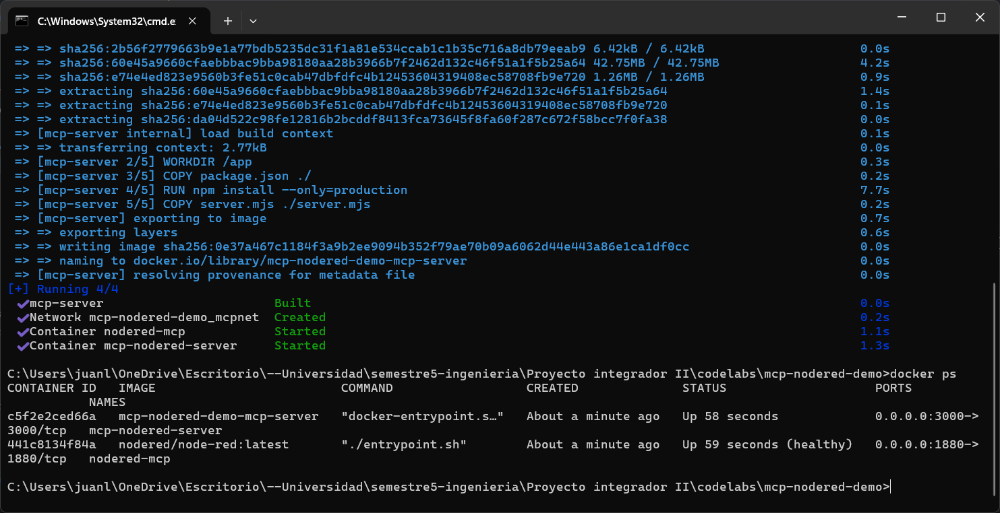
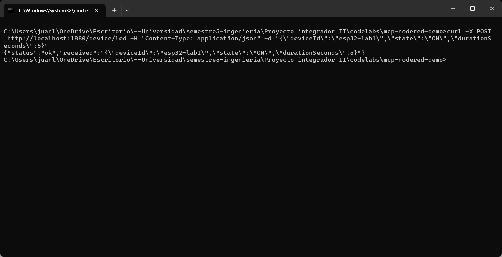
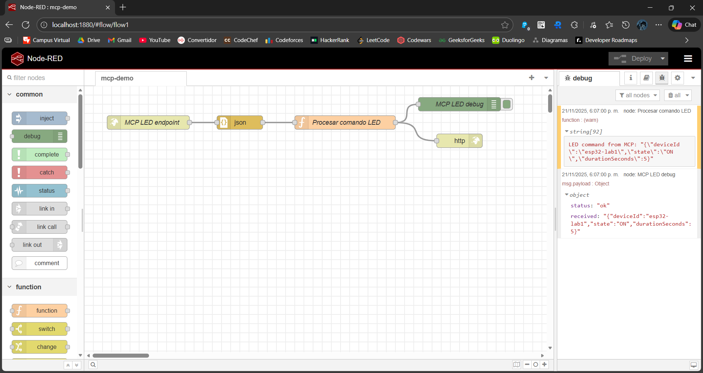
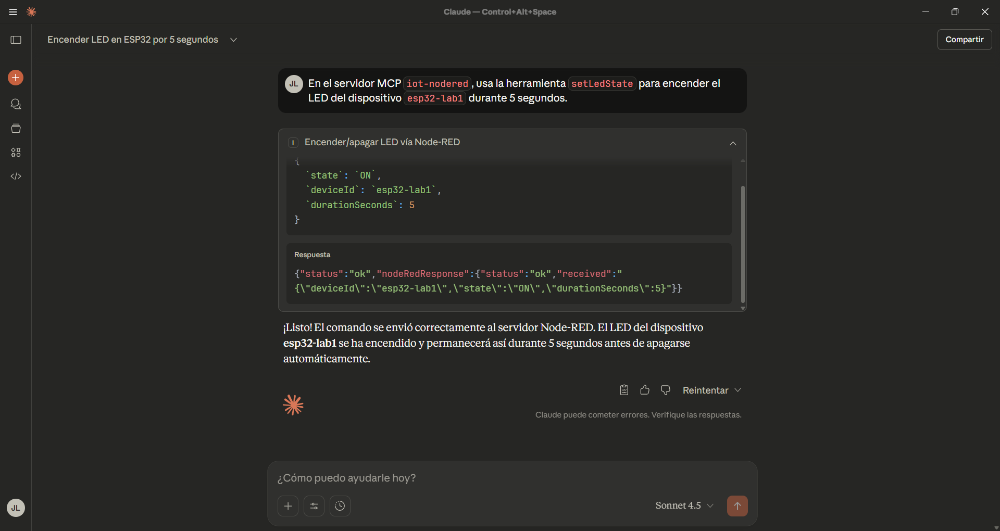
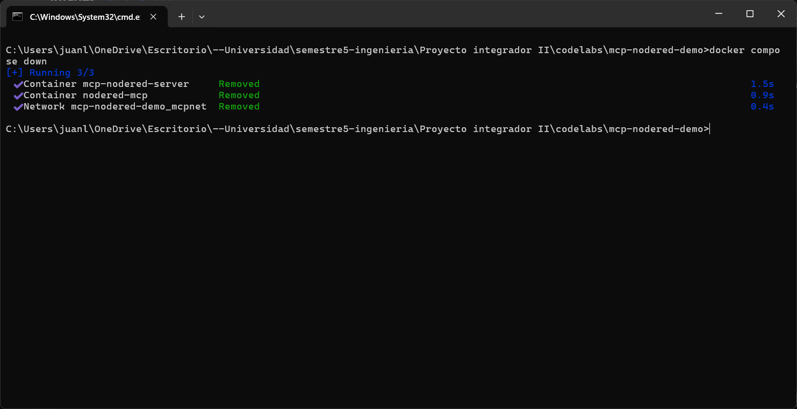

# mcp-nodered-demo

Proyecto de ejemplo para conectar una IA (Claude Desktop) con un sistema IoT usando:

- **MCP (Model Context Protocol)**
- **Node-RED**
- **HTTP + MQTT (EMQX)**
- **ESP32 + OLED I²C**

La IA no habla directo con el hardware: habla con un **servidor MCP**, que llama a **Node-RED**, y desde ahí se orquesta MQTT hacia los ESP32.

---

## Estructura del proyecto

```text
mcp-nodered-demo/
├─ docker-compose.yml
├─ nodered/
│  └─ data/
│     └─ flows.json
└─ mcp-server/
   ├─ Dockerfile
   ├─ package.json
   └─ server.mjs
```

---

## Prerrequisitos

* Docker y docker compose
* Git
* Claude Desktop
* Node.js + npm (para `npx mcp-remote`)
* Opcional: broker **EMQX** y **ESP32 + OLED I²C** ya funcionando con MQTT

---

## Puesta en marcha rápida

### Clonar y levantar

```bash
git clone URL_DEL_REPO mcp-nodered-demo
cd mcp-nodered-demo
docker compose up -d --build
```

Servicios:

* Node-RED: `http://localhost:1880`
* MCP server: `http://localhost:3000/mcp`

Prueba rápida a Node-RED:

```bash
curl -X POST http://localhost:1880/device/led \
  -H "Content-Type: application/json" \
  -d '{"deviceId":"esp32-lab1","state":"ON","durationSeconds":5}'
```

---

## Herramienta MCP setLedState

El servidor MCP expone una única herramienta:

* `name`: `setLedState`
* Entrada:

  * `deviceId`: `string`
  * `state`: `"ON"` | `"OFF"`
  * `durationSeconds`: `number` (opcional)
* Acción:

  * Envía `POST` a `http://NODERED_URL/device/led`
* Salida:

  * `status`: `"ok"`
  * `nodeRedResponse`: respuesta de Node-RED

---

## Configuración en Claude Desktop

Editar:

```text
~/Library/Application Support/Claude/claude_desktop_config.json
```

Agregar:

```json
{
  "mcpServers": {
    "iot-nodered": {
      "command": "npx",
      "args": [
        "-y",
        "mcp-remote",
        "http://localhost:3000/mcp"
      ]
    }
  }
}
```

Reinicia Claude Desktop.

Ejemplo de uso (en lenguaje natural):

> “En el servidor MCP `iot-nodered`, usa la herramienta `setLedState` para encender el LED del dispositivo `esp32-lab1` durante 5 segundos.”

---

## Reto sugerido

* En Node-RED:

  * Agregar **mqtt out** para publicar a EMQX (`lab1/esp32/led`).
  * Adaptar el `function` para que:

    * Primera salida → respuesta HTTP actual.
    * Segunda salida → JSON por MQTT (incluyendo un campo `message`).
* En ESP32:

  * Suscribirse a `lab1/esp32/led`.
  * Parsear el JSON recibido.
  * Mostrar `message` en la **pantalla OLED I²C**.

Objetivo: cuando invoques `setLedState` desde Claude, el mensaje correspondiente se vea en la OLED del ESP32.

---

## Licencia

MIT License

---

## Resultados

### Levantar los servicios



### Prueba Endpoint Terminal



### Prueba Enpoint Node-RED



### Prueba Endpoint Claude Desktop



### Detener los servicios


